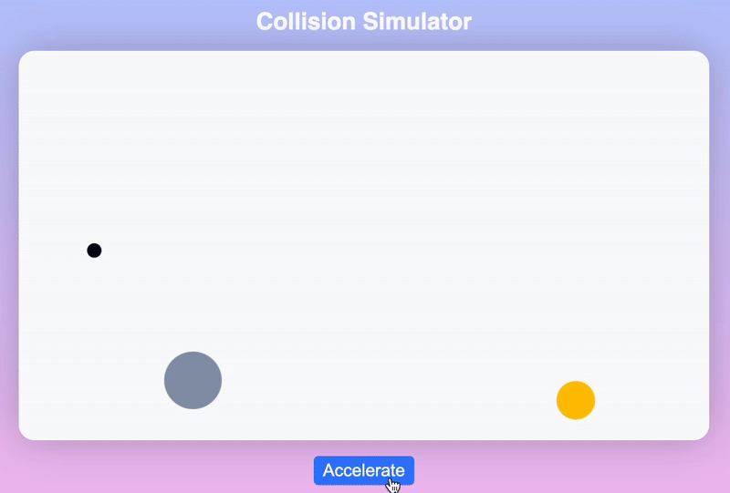

# Collision Simulator

A Web collision & motion simulator

## Description

This collision simulator graphically recreates the impact of colliding objects. It's built using the JavaScript Canvas API

## Installing

Clone the repo
   ```sh
   git clone https://github.com/SimphiweNkabinde/colliding-particles.git
   ```

## Executing program

open `index.html` in a browser

## Usage
Click the accelerate button to accelerate the moving particles.





